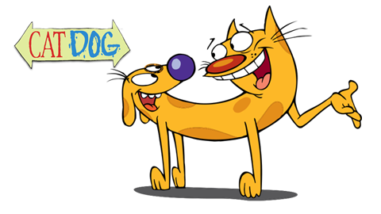

# Catdog-Classifier

This project consist of a Binary classifier based on the cats vs dogs dataset used in the following paper.

Elson, Jeremy and Douceur, John (JD) and Howell, Jon and Saul, Jared. (2007). *Asirra: A CAPTCHA that Exploits Interest-Aligned Manual Image Categorization*. Retrieved from *https://www.microsoft.com/en-us/research/publication/asirra-a-captcha-that-exploits-interest-aligned-manual-image-categorization/*

The project itself is served by a ***Flask*** application and has a training accuracy of **98%** as well as a validation accuracy of **92%**.

Feel free to download the project and try the application.

In order to run the project you need to install **Tensorflow 2.2.0**, **Flask**, and other basic libraries like **Numpy**. I highly recommend to use conda environments.

